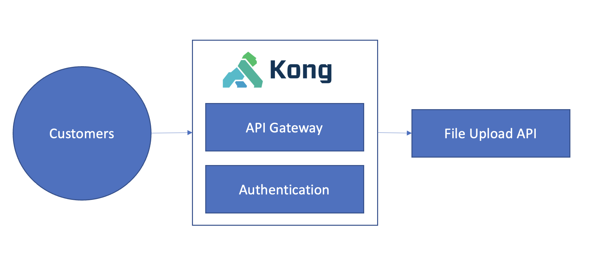

# file-upload-service

demonstration to implement upload file service with Oauth2, deploy by using docker.

## Overview
This solution is used Kong for authentication and authorization by using Oauth2 plugin.
And alos use Kong for doing the API Gateway.

The file upload api is implemented by Spring Boot.




## Quick start

```
./run.sh
```

## How it work

1. Import the postman collection.
2. To get authorization code, put some user infomation here including email to notify when upload completed, getting the code by calling /api/oauth2/authorize 
3. Then to get access token by calling /api/oauth2/token
4. Now we have access token to upload file by calling /api/upload (don't foget to select file)
